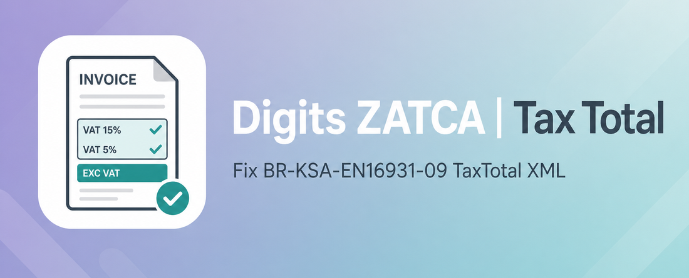
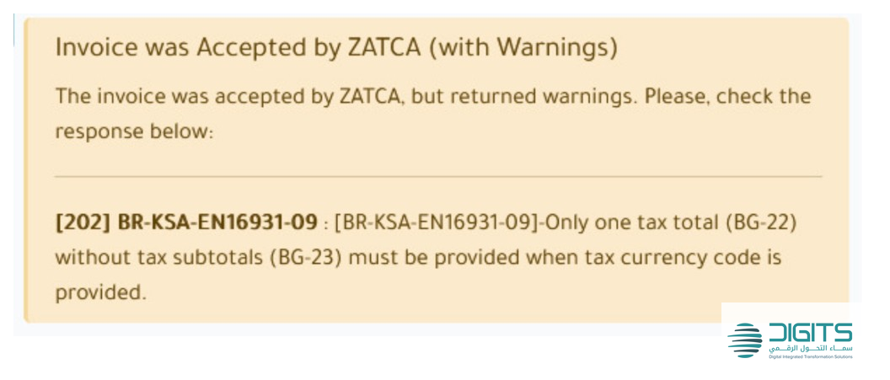

# Digits ZATCA | Tax Total (Fix Issue)

## التحذير الذي يصلحه هذا الموديول

بعد إرسال الفاتورة لهيئة الزكاة والضريبة والجمارك، تظهر هذه الرسالة الصفراء في محادثة الفاتورة. الفاتورة **مقبولة**، لكن التحذير يتكرر على كل فاتورة بالريال:

| الحقل | القيمة |
|---|---|
| الحالة | Invoice was Accepted by ZATCA (with Warnings) |
| الرمز | `[202] BR-KSA-EN16931-09` |
| النص | Only one tax total (BG-22) without tax subtotals (BG-23) must be provided when tax currency code is provided. |

## The warning this module fixes

After sending a customer invoice to ZATCA, Odoo posts this yellow chatter warning. The invoice is **accepted**, but the warning repeats on every SAR invoice:

| Field | Value |
|---|---|
| Status | Invoice was Accepted by ZATCA (with Warnings) |
| Code | `[202] BR-KSA-EN16931-09` |
| Message | Only one tax total (BG-22) without tax subtotals (BG-23) must be provided when tax currency code is provided. |

## Cause / السبب

Odoo 18 always sends `TaxCurrencyCode` (company currency, usually SAR). ZATCA rule **BR-KSA-EN16931-09** then requires two document-level `cac:TaxTotal` nodes:

1. **With** `TaxSubtotal` — VAT breakdown in the invoice currency (BG-22 + BG-23)
2. **Without** `TaxSubtotal` — VAT amount in the tax/accounting currency (BT-111)

A core Odoo 18 change dropped node (2) when invoice currency equals company currency (SAR). Foreign-currency invoices (USD, …) already include node (2) and do not get this warning.

أودو 18 يرسل دائماً `TaxCurrencyCode`. الهيئة تطلب عندها عنصرين لإجمالي الضريبة: واحد مع التفصيل وواحد بدونه. تحديث أودو أزال العنصر الثاني لفواتير الريال.

## What this module does / ماذا يفعل الموديول

Overrides `account.edi.xml.ubl_21.zatca` and restores the second `TaxTotal` **without** `TaxSubtotal` when it is missing.

- SAR invoices: add the missing node
- Foreign-currency invoices: leave standard Odoo XML unchanged (no duplicate)

يعيد عنصر `TaxTotal` الثاني بدون تفصيل لفواتير الريال، ولا يكرّره إذا كانت الفاتورة بعملة أجنبية.

## Install / التثبيت

1. Add this module on the Odoo 18 addons path (UAC repo).
2. Apps → Update Apps List.
3. Install **Digits ZATCA | Tax Total (Fix Issue)** (`digits_zatca_tax_total`).
4. New invoices sent to ZATCA after install will no longer show this warning.

Already-sent invoices stay accepted; they are not re-submitted.

1. ضع الموديول على مسار الإضافات.
2. التطبيقات → تحديث قائمة التطبيقات.
3. ثبّت **Digits ZATCA | Tax Total (Fix Issue)**.
4. الفواتير الجديدة بعد التثبيت تُرسل بالـ XML الصحيح.

الفواتير المرسلة مسبقاً تبقى مقبولة لدى الهيئة ولا تُعاد إرسالها.

## Requirements

- Odoo 18.0
- `l10n_sa_edi`

## Support

Developed by **Digital Integrated Transformation Solutions (DigitsCode)**.

- Website: [digitscode.com](https://www.digitscode.com)
- Email: info@digitscode.com
